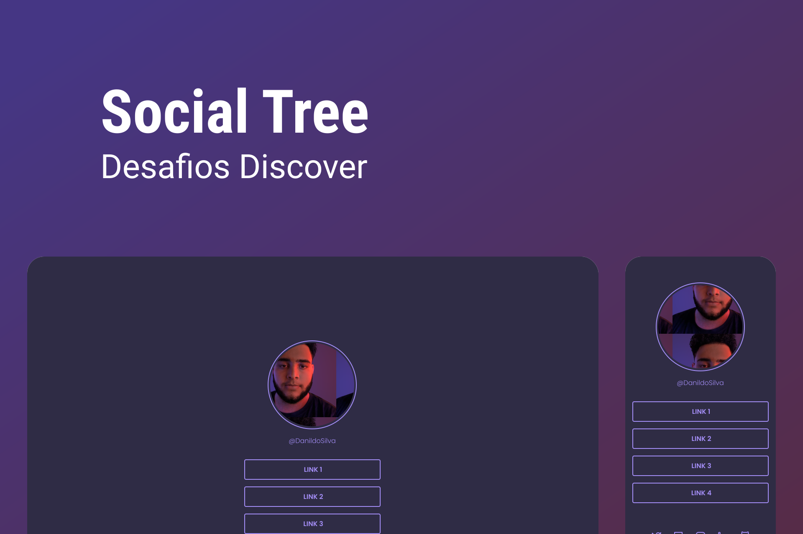

<h1 align="center"> Danildo Silva - Social Tree </h1>

Challenge from Rocketseat Discover 

  <a href="#-technologies">Technologies</a>&nbsp;&nbsp;&nbsp;|&nbsp;&nbsp;&nbsp;
  <a href="#-project">Project</a>&nbsp;&nbsp;&nbsp;|&nbsp;&nbsp;&nbsp;
  <a href="#-layout">Layout</a>&nbsp;&nbsp;&nbsp;|&nbsp;&nbsp;&nbsp;
  <a href="#memo-license">License</a>

  

 

  

## 🚀 Technologies

This project was developed with the following technologies:

- HTML e CSS
- Git & GitHub

## 💻 Project

The Social Tree is a project of a Social Link site.

## 🔖 Layout

You can view the layout of the project through [THIS LINK](https://www.figma.com/file/yfsZp24aQGs2ZNuNwl6Qj5/Social-links?node-id=120%3A19&t=Moa0T9233uEyYYXK-1). You need an account on [Figma](https://figma.com) to access it.

## :memo: License

This project is under the MIT license.

---

Made with ♥ by Danildo Silva :wave: [Connect with me!](https://www.linkedin.com/in/danildosilva/)
